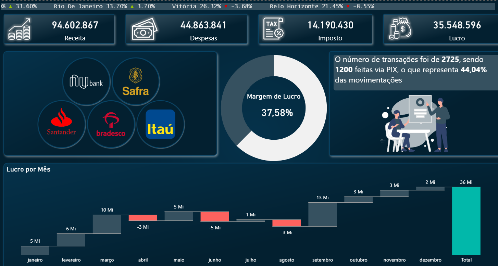
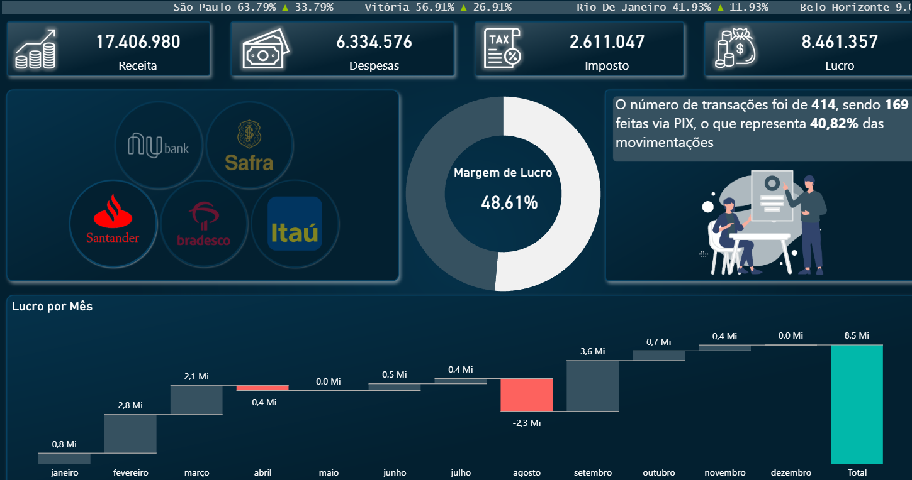
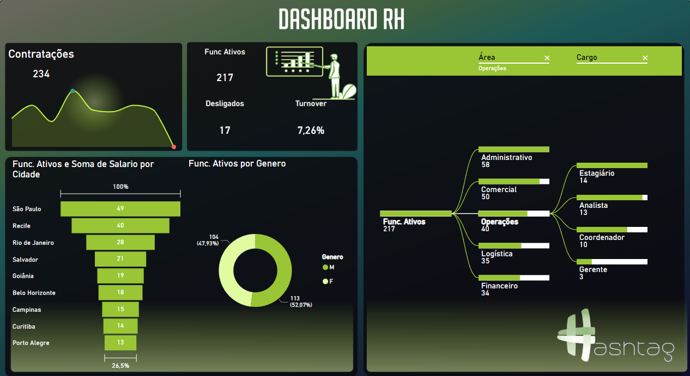
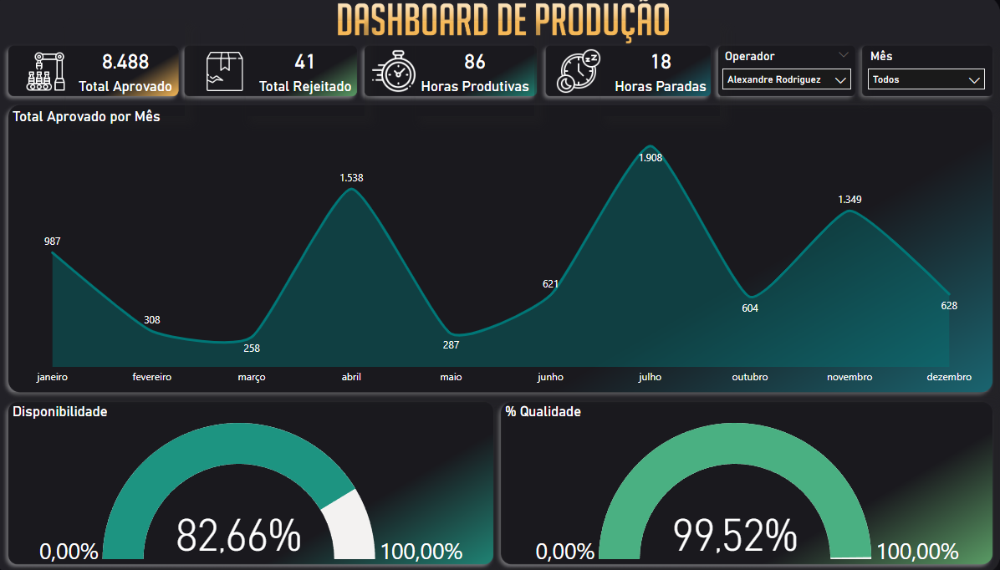
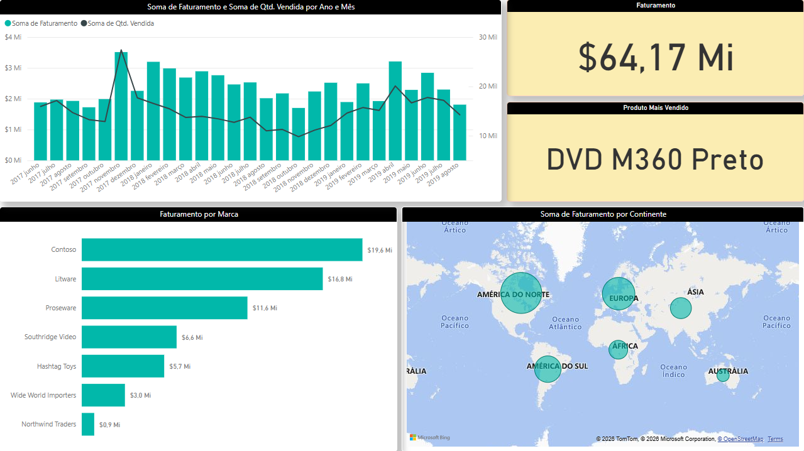
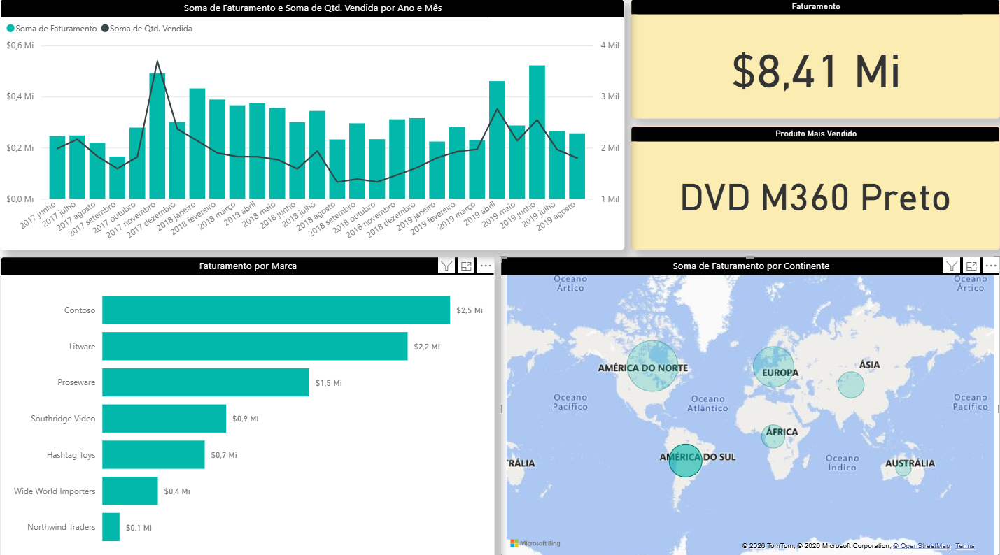

# Portfólio de Dashboards BI (Study_BI)

## 1. Finance BI (Dashboard Financeiro)
**Pasta:** [`/finance_BI`](./finance_BI)

Dashboard desenvolvido para análise detalhada de movimentações bancárias, com foco em receita, despesas, impostos e lucratividade. Permite análises comparativas por instituição (Itaú, Nubank, Bradesco, Santander, Safra), forma de pagamento (PIX, Boleto, etc.), município e evolução temporal.

**Destaques:**
- **Ticker Scroller:** Uma faixa de rolagem automática com KPIs no topo do dashboard, similar a painéis de bolsas de valores.
- **Data Storytelling:** Texto narrativo gerado dinamicamente via DAX que interpreta os números em linguagem natural e se adapta aos filtros (ex: visão por banco).
- **Gráfico de Cascata:** Ideal para visualização do fluxo de lucros e perdas ao longo dos meses.

### Preview

---

## 2. HR BI (People Analytics)
**Pasta:** [`/hr_BI`](./hr_BI)

Painel de Recursos Humanos (People Analytics) voltado para acompanhamento estratégico do capital humano. Permite visualizar e analisar o perfil da força de trabalho da empresa, acompanhando a evolução das contratações, taxa de turnover e distribuição por áreas, cargos, cidades e gênero.

**Principais Indicadores:**
- Evolução de Contratações, Desligados e Funcionários Ativos.
- Taxa de Turnover.
- Segmentação de colaboradores por Cidade, Gênero, Área e Cargo (fluxo).

### Preview

---

## 3. Prod BI (Monitoramento de Produção e Performance)
**Pasta:** [`/prod_BI`](./prod_BI)

Solução analítica focada na eficiência operacional de uma linha de produção. Este dashboard transforma dados de ordens de serviço em indicadores cruciais para suporte à tomada de decisão, visando identificar gargalos, otimizar tempos e garantir a qualidade final dos itens fabricados.

**Principais Indicadores:**
- Total de Horas Produtivas.
- Volumes de Quantidade Aprovada e Quantidade Rejeitada (análise de anomalias/perdas).
- Efetividade de Operação (comparativo entre tempo de preparação da máquina e tempo efetivo de produção).
- Ranking e Tendências de Performance por Operador e Produto.

### Preview

---

## 4. Sales BI (Análise de Vendas)
**Pasta:** [`/sales_BI`](./sales_BI)

Projeto focado em vendas desenvolvido durante um intensivo de BI. Extrai informações de transações globais de produtos (eletrônicos, eletrodomésticos, etc.) e as transforma em insights de desempenho financeiro, distribuição geográfica de vendas e performance de clientes e marcas.

**Destaques do Projeto:**
- **ETL com Power Query (M):** Limpeza e forte tipagem dos dados, tratamento de strings (inversão de "Sobrenome, Nome").
- **Modelagem Dimensional e Geografia:** Divisão e enriquecimento de colunas (ex: separação de Localidade em País e Continente) possibilitando hierarquias geográficas precisas.
- **DAX:** Desenvolvimento de métricas otimizadas como Faturamento Bruto e indicadores de negócio.

### Preview

---

## Autor
**Rodrigo Pinesso**  
[GitHub](https://github.com/rodrigopinesso/Study_BI)
