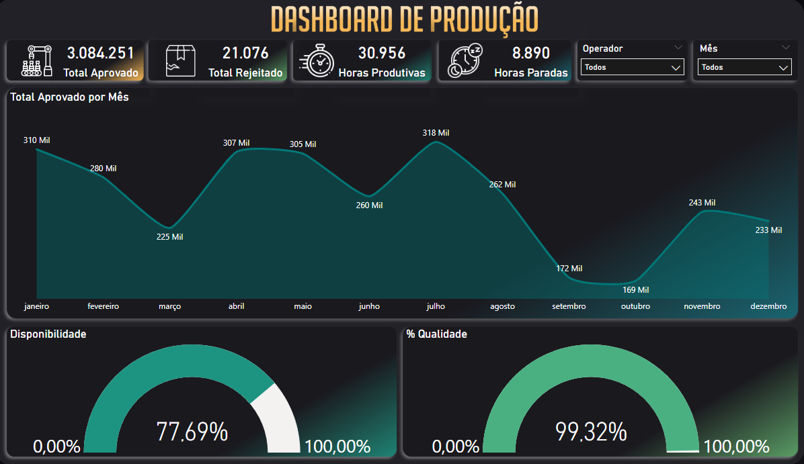

# Dashboard de Monitoramento de Producao e Performance

Solução de Business Intelligence desenvolvida para analisar a eficiencia operacional de uma linha de produção. O dashboard transforma dados brutos de ordens de servico em indicadores estrategicos (KPIs) para suporte a tomada de decisao.

---

## Preview



---

## Objetivo

Monitorar o fluxo de producao, identificando gargalos operacionais, taxas de rejeicao e a performance individual por operador e produto. A solucao visa otimizar o tempo de producao e garantir o controle de qualidade dos itens fabricados.

---

## Principais Indicadores (KPIs)

| Indicador | Descricao |
|---|---|
| Total de Horas | Volume total de tempo dedicado as ordens de producao |
| Quantidade Aprovada | Volume de itens que passaram pelo controle de qualidade |
| Quantidade Rejeitada | Mensuracao de perdas e necessidade de retrabalho |
| Efetividade de Operacao | Comparativo entre tempo de preparacao de maquina e tempo efetivo de producao |
| Top Operadores | Ranking por volume e qualidade de entrega por operador |
| Top Produtos | Ranking por volume e qualidade de entrega por produto |

---

## Estrutura dos Dados

A base de dados contem as seguintes dimensoes e fatos:

**Logistico**
- Numero da Ordem
- Data de Inicio e Fim
- Hora de Inicio e Fim

**Operacional**
- Identificacao do Operador
- Produto
- Ocorrencia (ex: Preparacao de Maquina, Controle de Qualidade)

**Metricas de Desempenho**
- Total de Horas
- Quantidade Aprovada
- Quantidade Rejeitada

---

## Tecnologias Utilizadas

| Tecnologia | Uso |
|---|---|
| Power BI | Modelagem de dados e visualizacao |
| Power Query (M) | ETL — limpeza de nulos, tipagem e tratamento de cronometragem |
| DAX | Medidas personalizadas para produtividade e taxas de rejeicao |
| Excel | Fonte de dados primaria |

---

## Estrutura do Repositorio

```
prod_BI/
├── dash/
│   └── prod_dash.pbix       # Arquivo Power BI
├── data/
│   └── Producao.xlsx        # Base de dados
├── img/
│   ├── prod_dash.png        # Print do dashboard
│   └── prod_name.png        # Print com identificacao
└── README.MD
```

---

## Funcionalidades

- **Filtros Dinamicos:** Segmentacao dos dados por periodo, operador e produto
- **Visualizacao de Tendencias:** Graficos de volume de producao ao longo do tempo
- **Analise de Qualidade:** Comparacao visual entre itens aprovados e rejeitados para identificacao rapida de anomalias no processo
